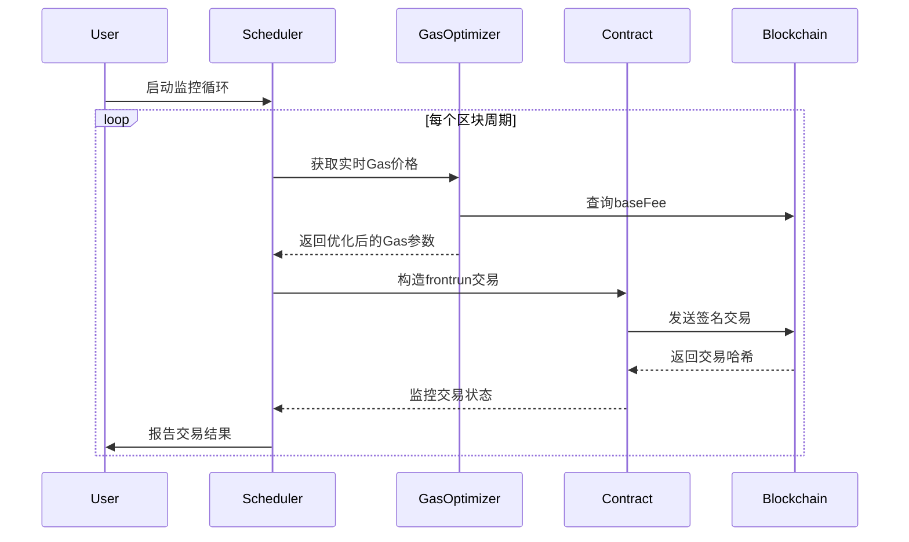

# 核心模块设计文档

## 交易发送引擎


## 关键数据结构
```rust
#[derive(Debug, Clone)]
pub struct FrontrunConfig {
    /// 目标合约地址
    pub contract_address: Address,
    /// 最大Gas价格 (Gwei)
    pub max_gas_price: U256,
    /// 交易间隔 (秒)
    pub interval_secs: u64,
    /// 紧急停止开关
    pub emergency_stop: AtomicBool,
}

#[derive(Debug, Clone, Copy)]
pub struct GasParams {
    pub base_fee: U256,
    pub priority_fee: U256,
    pub gas_limit: U256,
}
