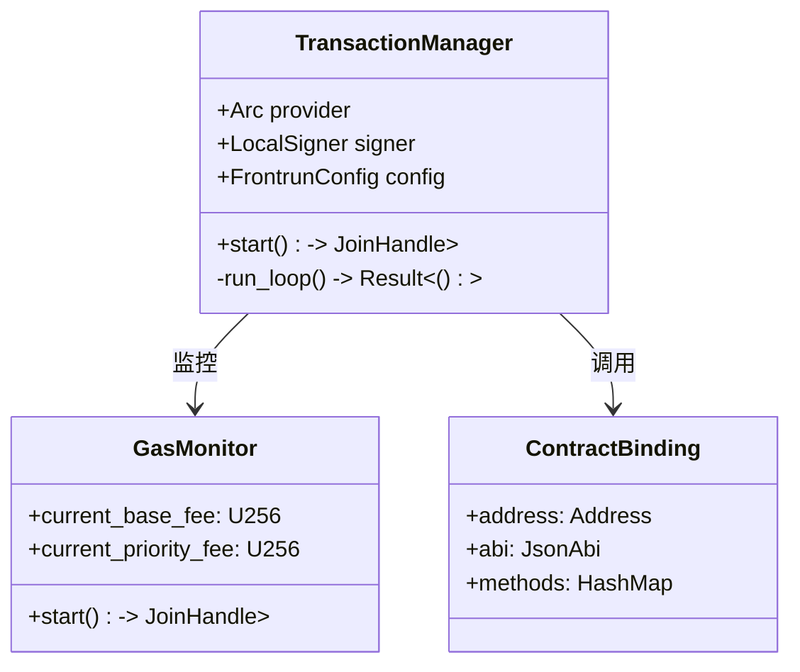

# 交易流程实现细节

## 异步任务管理架构


## 交易状态机实现
```rust
#[derive(Debug, Clone, Copy, PartialEq)]
enum TxState {
    Pending,
    Mined(BlockNumber),
    Confirmed(u64), // 确认数
    Failed(String),
}

impl TxState {
    fn transition(&self, new_state: Self) -> Result<Self> {
        match (self, new_state) {
            (Pending, Mined(n)) => Ok(Confirmed(1)),
            (Confirmed(c), Mined(n)) => Ok(Confirmed(c + 1)),
            (_, Failed(reason)) => Ok(Failed(reason)),
            _ => Err(eyre!("Invalid state transition")),
        }
    }
}
```

## 错误处理机制
```rust
#[derive(Debug, thiserror::Error)]
enum FrontrunError {
    #[error("Gas price exceeds limit {0} > {1}")]
    GasLimitExceeded(U256, U256),
    
    #[error("Transaction reverted: {0}")]
    Revert(String),
    
    #[error("Chain reorganization detected at block {0}")]
    Reorg(BlockNumber),
    
    #[error("Provider error: {0}")]
    Provider(#[from] alloy::providers::ProviderError),
}
```

## 交易重试策略
```rust
async fn send_with_retry(
    tx_builder: &TxBuilder,
    retry_policy: RetryPolicy
) -> Result<TransactionReceipt> {
    let mut attempt = 0;
    let mut backoff = Duration::from_secs(1);
    
    loop {
        match tx_builder.send().await {
            Ok(receipt) => return Ok(receipt),
            Err(e) if attempt < retry_policy.max_retries => {
                tokio::time::sleep(backoff).await;
                backoff = retry_policy.backoff_strategy(backoff);
                attempt += 1;
            }
            Err(e) => return Err(e),
        }
    }
}
