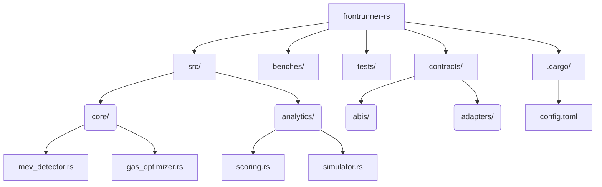

# 项目目录架构规范

## Rust项目结构蓝图


## 关键目录说明
### 核心业务模块
```mermaid
flowchart LR
    core/
    ├── detector[MEV探测器]
    ├── optimizer[Gas优化引擎]
    └── risk[风控系统]
    
    analytics/
    ├── scoring[机会评分模型]
    └── simulator[交易模拟器]
```

## 新旧项目路径映射表
| Go路径                | Rust路径                    | 改造要点         |
| --------------------- | --------------------------- | ---------------- |
| frontrunner.go        | src/core/mev_detector.rs    | 增加内存安全检查 |
| scripts/scores.go     | src/analytics/scoring.rs    | 并发性能优化     |
| contract/frontrunner/ | contracts/abis/frontrunner/ | 类型安全绑定     |

## 构建系统配置
```toml
# Cargo.toml 工作区配置
[workspace]
members = [
    "core",
    "analytics",
    "contracts"
]

[profile.release]
lto = true
codegen-units = 1
```

## 辅助目录规范
```mermaid
graph LR
    docs/
    ├── architecture[架构设计]
    └── decisions[技术决策]
    
    .github/
    ├── workflows[CI流水线]
    └── dependabot[依赖更新]
