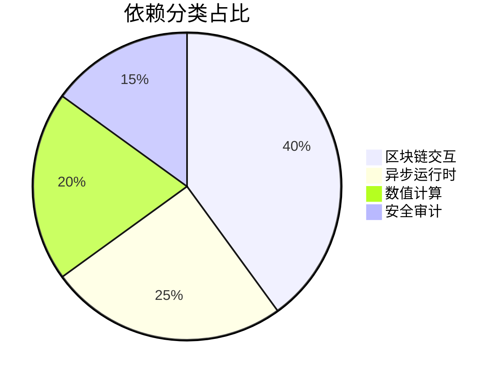
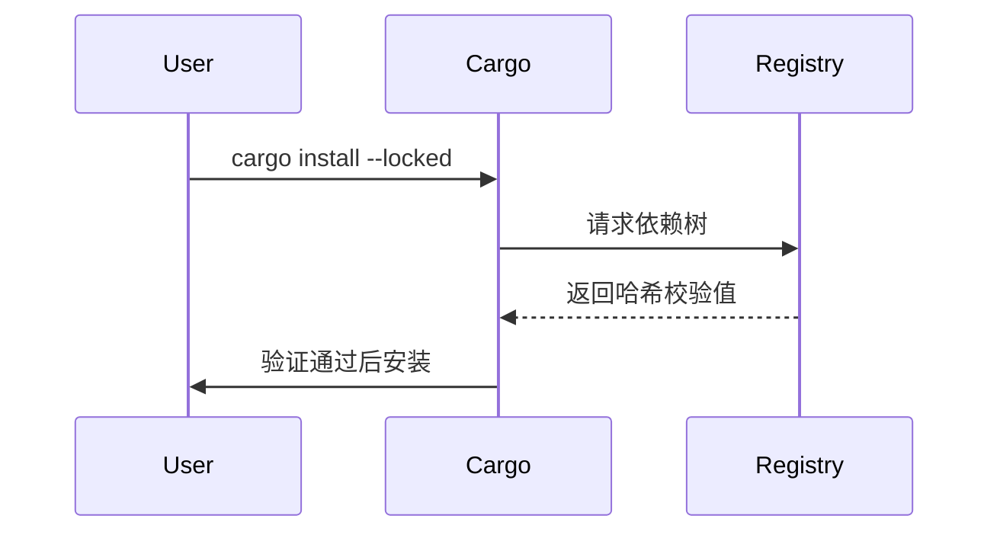

# 依赖管理系统规范

## 核心依赖矩阵


## 关键依赖清单
```toml
[dependencies]
alloy-rs = { version = "latest", features = ["full"] }
tokio = { version = "latest", features = ["full"] }
figment = { version = "latest", features = ["env", "toml"] }
rust-crypto = { version = "latest", features = ["serde"] }

[dev-dependencies]
criterion = "0.5.1"
proptest = "1.4.0"
```

## 安全安装流程


## 依赖更新策略
| 依赖类型   | 更新频率 | 验证要求          |
| ---------- | -------- | ----------------- |
| 核心运行时 | 季度更新 | 全量回归测试      |
| 安全相关   | 紧急更新 | 审计报告+单元测试 |
| 工具链     | 月度更新 | 编译检查          |

## 版本锁定机制
```bash
# 生成精确版本锁
cargo update --precise <package>@<version>

# 审计依赖安全
cargo audit
