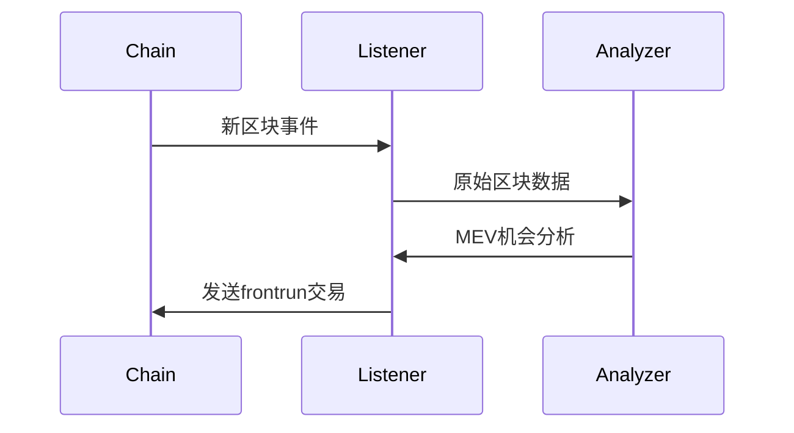

# 代码实现规范

## 合约交互模板
```rust
/// SAFETY: 必须包含Gas上限保护
macro_rules! guarded_call {
    ($contract:expr, $method:ident, $gas_limit:expr) => {
        async {
            let gas_estimate = $contract.$method().estimate_gas().await?;
            ensure!(gas_estimate <= $gas_limit, GasLimitExceeded(gas_estimate, $gas_limit));
            
            $contract
                .$method()
                .gas(gas_estimate * 110 / 100) // 10% buffer
                .gas_price(gas_oracle::current_price().await?)
                .send()
                .await
        }
    };
}
```

## 事件处理规范


## 错误处理模式
```rust
// 三层错误处理体系
#[derive(Debug, Error)]
enum FrontrunError {
    #[error("可恢复错误: {0}")]
    Recoverable(String),
    
    #[error("需人工干预: {0}")]
    HumanIntervention(String),
    
    #[error("致命错误: {0}")]
    Fatal(#[from] anyhow::Error),
}

impl From<alloy::providers::ProviderError> for FrontrunError {
    fn from(e: ProviderError) -> Self {
        match e {
            ProviderError::RateLimited => Self::Recoverable("API速率限制".into()),
            ProviderError::ConnectionRefused => Self::Fatal(e.into()),
            _ => Self::HumanIntervention(format!("未知provider错误: {}", e)),
        }
    }
}
```

## 性能关键路径
```rust
#[inline(always)]
fn hot_path_calculation(input: &[u64]) -> Result<u128> {
    let mut total = 0u128;
    for &num in input {
        total = total.checked_add(num as u128)
            .ok_or(FrontrunError::Fatal(eyre!("数值溢出")))?;
    }
    Ok(total * GAS_COEFFICIENT)
}
