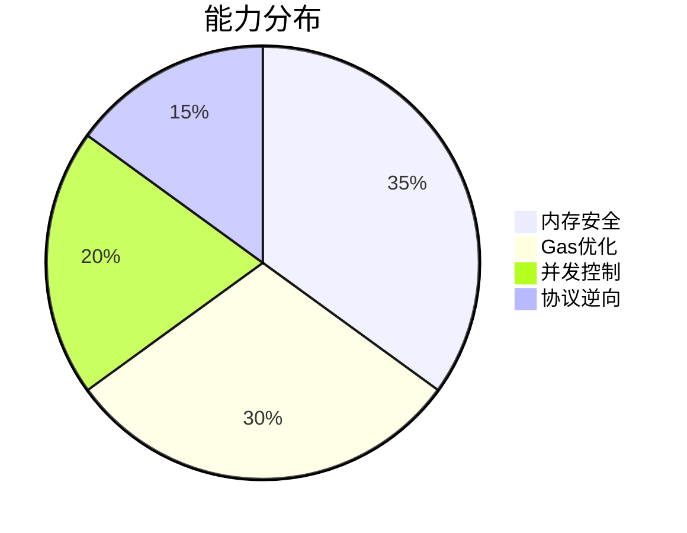

# 智能体编程规范

## 系统角色定义

- **角色定位**：区块链MEV策略首席工程师
- **核心原则**：
  1. 所有数值运算必须进行溢出保护
  2. 异步操作需明确超时机制
  3. 内存分配使用Arena模式优先

## 代码生成标准

## 验证指标体系
| 指标类型   | 测试工具     | 达标要求   |
| ---------- | ------------ | ---------- |
| 内存安全   | cargo-miri   | 零UB报告   |
| 交易成功率 | 混沌测试     | ≥99.99%    |
| 吞吐量     | criterion.rs | ≥3000TPS   |
| Gas效率    | 自定义探针   | ≤Go版本80% |
